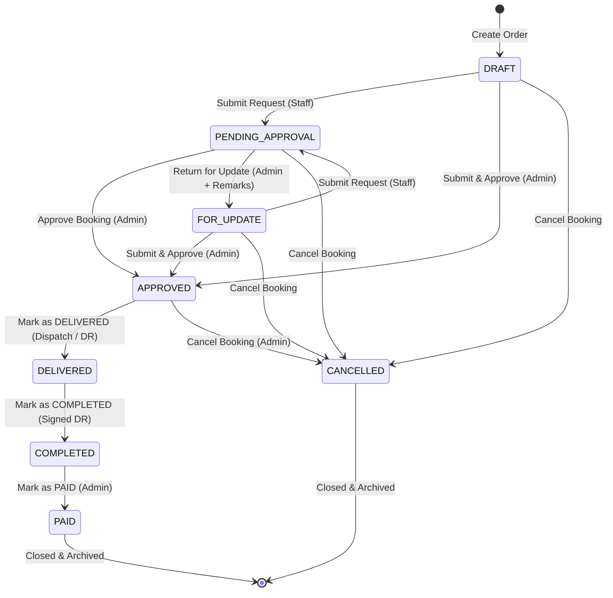

# Functional Requirements Specification (FRS)
## CPM (Catering & Packed Meals) Order Monitoring System
**Project Code Name:** Project Itadakimasu  
**Document Version:** 1.0  
**Last Updated:** August 2026

---

## 1. System Overview & Architecture Boundary

The CPM Order Monitoring System is a centralized, full-stack web application designed to manage the end-to-end operational lifecycle of catering and packed meal orders. It eliminates spreadsheet inaccuracies by providing relational database modeling, multi-day scheduling, dynamic cost calculations, document verification, role-based workflows, and automated PDF export engines.

```
       +-------------------------------------------------------------+             +---------------------+
       |                       Next.js (App Router)                  |             |     Data Layer      |
       |  +-----------------------+       +-----------------------+  |             | PostgreSQL Database |
       |  |     Presentation      |       |      Application      |  | <=========> | (Accessed via       |
       |  | React 19 + TypeScript | <===> | Route Handlers + JWT  |  |             |  Drizzle ORM)       |
       |  |  + Tailwind CSS v4    |       |      Middleware       |  |             +---------------------+
       |  +-----------------------+       +-----------------------+  |
       +-------------------------------------------------------------+
                                       ||
                                       \/
                             +-------------------+
                             |  Custom PDF Gen   |
                             | (Vector Streams)  |
                             +-------------------+
```

---

## 2. Functional Requirements Breakdown

### FR-1: Authentication, Session Management & Security

* **FR-1.1 Password Hashing**: Passwords must be hashed using Node's native `scryptSync` cryptographic algorithm with per-user unique salt generation and timing-safe comparison (`crypto.timingSafeEqual`) in [`src/lib/auth.ts`](file:///home/ronald/projects/cpm/src/lib/auth.ts).
* **FR-1.2 Encrypted Session Tokens**: Authenticated sessions must be stored in an `httpOnly`, `SameSite=Lax` cookie named `token` containing an AES-256-GCM encrypted payload (`userId`, `username`, `role`, `createdAt`).
* **FR-1.3 Session Expiration**: Sessions automatically expire after 12 hours. Expired cookies are cleared by Next.js Edge Middleware.
* **FR-1.4 Edge Route Guarding**: Middleware intercepts `/api/*` and guarded pages, decrypts the token, injects session headers (`x-user-id`, `x-username`, `x-role`), and blocks unauthenticated requests (HTTP 401).

---

### FR-2: Client Master Management

* **FR-2.1 Client Classification**: The system shall support 4 distinct client types:
  1. `COMPANY` (Private corporations / commercial entities)
  2. `GOVERNMENT` (Government agencies / public offices)
  3. `NON_PROFIT` (NGOs / foundations / religious organizations)
  4. `INDIVIDUAL` (Private individuals)
* **FR-2.2 Primary Contact Enforcement**:
  - For `COMPANY`, `GOVERNMENT`, and `NON_PROFIT`: `organization_name`, `first_name`, and `last_name` (Primary Contact Person) are required.
  - For `INDIVIDUAL`: `first_name` and `last_name` are required; `organization_name` is optional.
* **FR-2.3 Secondary Contact Information**:
  - Organization profiles support optional `secondary_contact_name`, `secondary_contact_phone`, and `secondary_contact_email`.
* **FR-2.4 Contact Formatting**: `email` must conform to standard RFC 5322 regex validation; `phone` must contain a minimum of 7 digits.

---

### FR-3: Catalog & Menu Item Ledger

* **FR-3.1 Discrete Food Items**: Master food items stored in `cpm_items` with fields `item_name` (Unique), `category` (e.g., `'Breakfast'`, `'Snack'`, `'Lunch'`, `'Dinner'`), and `unit_price` (`NUMERIC(10,2)`).
* **FR-3.2 Set Menu Packages**: Standard packages stored in `cpm_menus` with `title` (Unique), `description`, `base_rate` (`NUMERIC(12,2)`), and linked to discrete items via junction table `cpm_menu_items`.
* **FR-3.3 Soft Deletion**: Menus utilize an `is_active` boolean flag. Inactive menus are hidden from booking selection dropdowns but preserved on existing historical order records.
* **FR-3.4 Rate Freezing**: When a menu or item rate is assigned to an order, the rate is copied into `cpm_meal_periods.rate` to act as an immutable historical freeze point.

---

### FR-4: Booking Wizard & Order Scheduling Engine

* **FR-4.1 Multi-Day Relational Calendar**:
  - An order can contain $N \ge 1$ distinct calendar dates stored in `cpm_order_days`.
  - Database constraint: Unique composite index on `(order_id, event_date)` to prevent duplicate dates within the same booking.
* **FR-4.2 Discrete Meal Periods**:
  - Each order day contains $M \ge 1$ meal periods (`cpm_meal_periods`) with attributes: `meal_period` (Breakfast/Lunch/Dinner/Snack), `service_time` (HH:MM format), `pax` (integer headcount), and `rate` (`NUMERIC(12,2)`).
* **FR-4.3 Dynamic Package Assembly & Item Bundling**:
  - Users can select a pre-set menu package OR bundle multiple discrete food items (`cpm_meal_period_items`).
  - When bundling items, the system computes the custom package rate automatically:
    $$\text{Rate} = \sum \text{Item Unit Prices}$$
* **FR-4.4 Automated Financial Calculations**:
  - Meal Period Subtotal:
    $$\text{Subtotal} = \text{Pax} \times \text{Rate}$$
  - Grand Total:
    $$\text{Grand Total} = \sum_{\text{days}} \sum_{\text{meals}} \text{Subtotal}$$
  - Direct manual overwriting of calculated Grand Total values is strictly blocked.
* **FR-4.5 Structured Delivery Address Breakdown**:
  - Master order record (`cpm_orders`) supports structured fields: `unit_number`, `floor_number`, `building_name`, `street_number`, `street_name`, and `landmark`.
  - Concatenates into `custom_delivery_address` for display and legacy integration.
* **FR-4.6 Catering Event Name**:
  - Required when the selected service type is Catering (`Buffet Set-up`).

---

### FR-5: Document Attachment & Verification Subsystem

* **FR-5.1 Supported Document Types**:
  1. `PURCHASE_ORDER` (PO reference for booking confirmation)
  2. `DELIVERY_RECEIPT` (DR confirming event dispatch/delivery)
  3. `SIGNED_DELIVERY_RECEIPT` (Signed DR confirming completion and billing readiness)
  4. `OTHER` (General supporting documents)
* **FR-5.2 File Storage & Limits**:
  - Multipart upload handler accepts PDF, PNG, JPG, JPEG, DOC, and DOCX formats up to 15 MB.
  - Stored locally via [`src/lib/storage.ts`](file:///home/ronald/projects/cpm/src/lib/storage.ts) at `public/uploads/orders/<orderId>/<filename>`.
* **FR-5.3 Document Verification Workflow**:
  - Uploaded attachments default to `is_approved = FALSE` (Pending Review).
  - Admin users can review attachments and call `/api/orders/:id/attachments/:attachmentId/approve` to mark `is_approved = TRUE`, recording `approved_by_user_id` and `approved_at`.

---

### FR-6: Order Lifecycle State Machine



#### State Transition & Permission Rules:

| Initial State | Allowed Action | Target State | Authorized Role | Mandatory Requirements / Effects |
| :--- | :--- | :--- | :--- | :--- |
| `DRAFT` / `FOR_UPDATE` | Submit Request | `PENDING_APPROVAL` | `USER` (Staff), `ADMIN` | Activates edit lock. Moves order to Admin review queue. |
| `DRAFT` / `FOR_UPDATE` | Submit & Approve | `APPROVED` | `ADMIN` only | Bypasses queue. Immediately generates invoice PDF. |
| `PENDING_APPROVAL` | Approve Booking | `APPROVED` | `ADMIN` only | Generates static invoice PDF. Locks modifications. |
| `PENDING_APPROVAL` | Return for Update | `FOR_UPDATE` | `ADMIN` only | **Mandatory remarks required**. Unlocks edit mode for staff. |
| `APPROVED` | Mark as DELIVERED | `DELIVERED` | `USER`, `ADMIN` | Confirms event catering dispatch (DR uploaded). |
| `DELIVERED` | Mark as COMPLETED | `COMPLETED` | `USER`, `ADMIN` | Confirms client sign-off (Signed DR uploaded). Ready for billing. |
| `COMPLETED` | Mark as PAID | `PAID` | `ADMIN` only | Acknowledges full payment settlement. Closes booking. |
| Any Active State | Cancel Booking | `CANCELLED` | `ADMIN` (all), `USER` (drafts) | **Mandatory reason required** for Admin cancellations. |

---

### FR-7: Immutable Audit Trail & Historical Ledger

* **FR-7.1 Chronological Logging**: Every status transition automatically creates a record in `cpm_order_history` capturing `order_id`, `from_status_id`, `to_status_id`, `changed_by_user_id`, `remarks`, and `created_at`.
* **FR-7.2 Immutability**: Updates and deletions on `cpm_order_history` are blocked at the database level to maintain legal and financial audit integrity.

---

### FR-8: Multi-Format PDF Export Engines

The system implements zero-dependency raw vector PDF stream generators in [`src/lib/pdf.ts`](file:///home/ronald/projects/cpm/src/lib/pdf.ts):

* **FR-8.1 Customer Invoice PDF (`/api/orders/:id/pdf`)**:
  - Multi-page document rendering exactly one calendar day per page.
  - Aligned tables displaying Rate, Pax, and Subtotals per meal period.
  - Header displays client profile, primary/secondary contacts, event name, and venue/delivery address.
* **FR-8.2 Kitchen Production Slip (`/api/orders/:id/kitchen-pdf`)**:
  - Displays event date, ingress/egress timings, meal periods, service times, and discrete food items with headcounts.
  - **Excludes all monetary rates, subtotals, and billing amounts**.
* **FR-8.3 Landscape Order Monitoring Report (`/api/orders/report-pdf`)**:
  - Landscape orientation (`Page Size: 792 x 612 pt`).
  - Columns: ID, Client/Organization, Pax, Delivery Address (with text word-wrap), Date Span, Service Type, Grand Total.
  - Synchronizes with active search, client, date, and status filters.
* **FR-8.4 Catalog PDF Reports (`/api/catalogs/menus/report-pdf`, `/api/catalogs/items/report-pdf`)**:
  - Generates itemized catalogs of menu packages and food items.

---

### FR-9: Design Tokens & Styling Standardization

* **FR-9.1 Design Tokens Module**: Centralized tokens defined in [`src/lib/designTokens.ts`](file:///home/ronald/projects/cpm/src/lib/designTokens.ts):
  - **Brand**: Blue-600 (`#2563eb`), Blue-700 (`#1d4ed8`), Sky-400 (`#38bdf8`).
  - **Neutrals**: Slate-50 through Slate-950 surfaces.
  - **Status Badges**: Standardized CSS class helper `getStatusBadgeClass(status)`.
  - **PDF Colors**: Vector operator strings (`0.145 0.388 0.922 rg`) mirroring web brand tokens.

---

### FR-10: Non-Functional & Operational Requirements

* **FR-10.1 Response Latency**: Core dashboard and order list API queries must hydrate in $< 300\text{ ms}$.
* **FR-10.2 PDF Generation Performance**: Vector PDF generation must complete synchronously in $< 50\text{ ms}$ per order.
* **FR-10.3 Containerization**: Packaged via multi-stage Docker build producing a standalone Next.js production image (`node server.js`).
* **FR-10.4 Persistent Volumes**: Uploaded documents (`public/uploads/`) and generated invoices (`public/invoices/`) must be mounted to external persistent volumes in container environments.
