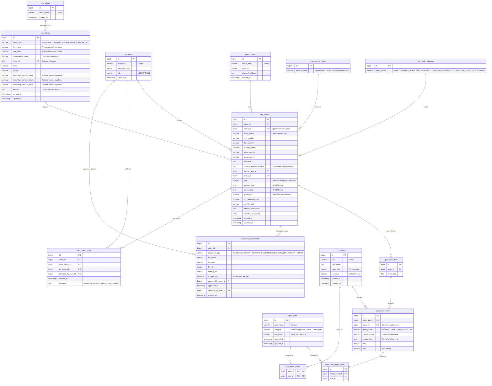
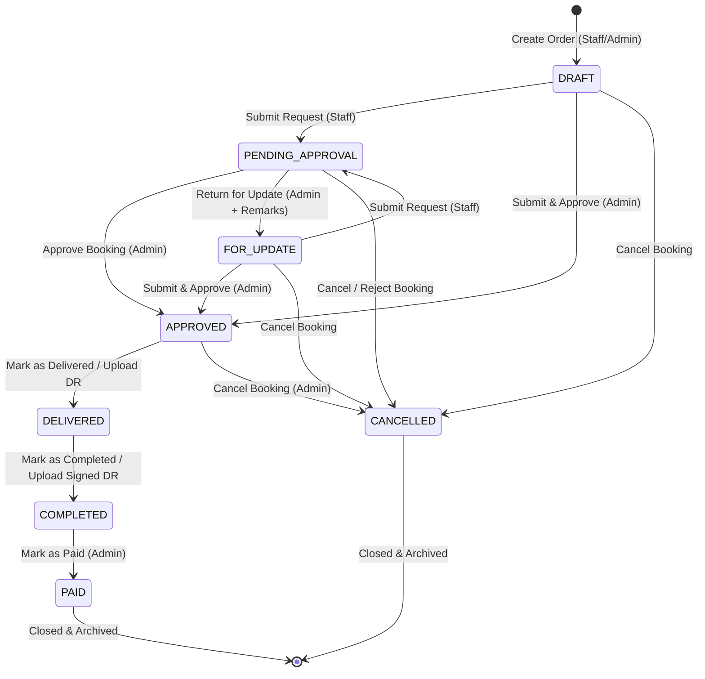

# Project Plan & Engineering Blueprint — Project Itadakimasu
## CPM (Catering & Packed Meals) Order Monitoring System
**Document Version:** 2.0 (Comprehensive From-Scratch Blueprint)  
**Target Delivery Window:** 12-Week Phased Rollout  
**Last Updated:** August 2026

---

## 1. Executive Summary & Project Charter

### 1.1 Business Context & Problem Statement
Prior to this system, catering and packed meal operations relied on manual, multi-tabbed spreadsheets. This approach introduced critical operational bottlenecks:
* **Data Inconsistencies & Invalid Formats**: Loose text entries in temporal fields (e.g., `"March 16 to..."`, `"TBA"`, `"None"`), preventing automated grouping and reporting.
* **Duplicate & Redundant Entries**: Prevalent `"Copy of..."` naming strings causing ambiguity between finalized invoices and exploratory quotes.
* **Fragile Financial Computations**: User input cells shared spaces with formulas, leading to accidental formula overwrites and manual subtotal errors.
* **Lack of Operational Traceability**: Absence of a formal state machine or audit trail for order approvals, returns, dish modifications, and payment settlements.

**Project Itadakimasu** delivers the **CPM Order Monitoring System** — a centralized, web-based platform engineered to enforce referential integrity, automate cost computations, provide multi-day event scheduling, manage supporting document verifications, and execute a formal 8-state order lifecycle workflow.

### 1.2 Project Vision & Core Business Objectives
* **100% Referential & Calculation Integrity**: Eliminate spreadsheet formula discrepancies through database-level constraints and dynamic price rollups.
* **Structured Multi-Day Operations**: Provide a multi-step booking wizard supporting multi-day itineraries, discrete meal periods (Breakfast, AM Snack, Lunch, PM Snack, Dinner), and custom dish packaging.
* **Document Verification Workflow**: Support uploading and Admin approval of Purchase Orders (PO), Delivery Receipts (DR), and Signed Delivery Receipts to drive status progression.
* **Strict Role-Based Governance**: Protect corporate assets using AES-GCM encrypted sessions, role-based access control (Staff vs. Admin), and immutable historical audit logging.
* **Automated PDF Export Engines**: Generate print-ready Invoice PDFs, Kitchen Production Slips, Landscape Order Reports, and Catalog sheets synchronously without headless browser overhead.

### 1.3 Scope Boundary Matrix

```
+----------------------------------------------------+---------------------------------------------------+
|               In Scope (Phase 1)                   |               Out of Scope (Phase 2)              |
+----------------------------------------------------+---------------------------------------------------+
| * Normalized PostgreSQL Relational Schema          | * Real-time Raw Ingredient Inventory Checks       |
| * 4 Client Types (Company, Gov, Non-Profit, Indiv) | * Automated Ingredient Margin Costing (COGS)      |
| * Secondary Contact Persons & Numbers              | * Client SMS & External SMTP Email Triggers       |
| * Structured Address Breakdown & Landmarks         | * Native Mobile Applications (iOS / Android)      |
| * Multi-Day Order Scheduling & Meal Mappings       |                                                   |
| * Custom Package Assembly & Item Bundling          |                                                   |
| * Document Uploads (PO, DR, Signed DR) & Approvals |                                                   |
| * 8-State Order Lifecycle Machine (Draft -> Paid)  |                                                   |
| * Role-Based Access Control & JWT Authentication   |                                                   |
| * Immutable Audit Trail Ledger                     |                                                   |
| * Custom Zero-Dependency PDF Vector Engines        |                                                   |
| * Consolidated Design Tokens (Web & PDF)           |                                                   |
| * Multi-Stage Docker Containerization              |                                                   |
+----------------------------------------------------+---------------------------------------------------+
```

### 1.4 Stakeholder & RACI Matrix

| Role / Persona | Description | Project Responsibilities |
| :--- | :--- | :--- |
| **Executive Sponsor** | Executive Leadership | Project charter approval, strategic scope sign-off. |
| **Operations Lead / Admin** | Catering Operations Manager | Catalog curation, order review/approvals, document approvals, payment closure. (Accountable/Responsible) |
| **Sales Staff / User** | Client Representatives | Client registration, order draft creation, multi-day scheduling, PO/DR file uploads. (Responsible) |
| **Kitchen Lead** | Kitchen & Dispatch Supervisor | Meal preparation schedules, dish portioning, dispatch timings via Kitchen Slips. (Consulted/Informed) |
| **Finance Officer** | Billing Specialist | Invoice verification, signed DR reconciliation, payment confirmation. (Informed/Responsible) |
| **Development Team** | Full-Stack Engineers & QA | Application architecture, database migrations, security, and deployment. (Responsible) |

---

## 2. Requirements & Specifications Framework

### 2.1 User Persona & Epic Reference
The system's functional capabilities map directly to the 6 epics detailed in [`docs/user-stories.md`](file:///home/ronald/projects/cpm/docs/user-stories.md):
1. **Epic 1: Authentication & Role-Based Access Control** (Encrypted JWT cookie auth, role-based UI adaptations).
2. **Epic 2: Client Profile & Organization Directory** (4 client types, primary/secondary contact tracking).
3. **Epic 3: Catalog & Menu Item Ledger** (Discrete food items, package pricing, soft deletion).
4. **Epic 4: Booking Wizard & Order Scheduling Engine** (Multi-day scheduling, serving times, structured addresses, dynamic item bundles).
5. **Epic 5: Order Lifecycle, Verification & Approval Workflow** (Submit, approve, return with remarks, DR verification, payment closure).
6. **Epic 6: Reporting & Multi-Format PDF Outputs** (Day-by-day Invoices, Kitchen Slips, Landscape Order Reports, Catalogs).

### 2.2 Functional Specifications Summary
Refer to [`docs/functional-requirements.md`](file:///home/ronald/projects/cpm/docs/functional-requirements.md) for granular field constraints and business rules:
* **FR-1**: Cryptographic password hashing (`scryptSync`), AES-GCM session tokens, 12-hour session lifespan, Edge route guarding.
* **FR-2**: Client validation rules for `COMPANY`, `GOVERNMENT`, `NON_PROFIT`, and `INDIVIDUAL` entities.
* **FR-3**: Item pricing precision (`NUMERIC(10,2)`), menu package rate freezing on order assignment.
* **FR-4**: Composite uniqueness on `(order_id, event_date)`, dynamic rate summation formula:
  $$\text{Rate} = \sum \text{Unit Prices}, \quad \text{Subtotal} = \text{Pax} \times \text{Rate}, \quad \text{Grand Total} = \sum \text{Subtotals}$$
* **FR-5**: Multipart file uploads for `PURCHASE_ORDER`, `DELIVERY_RECEIPT`, `SIGNED_DELIVERY_RECEIPT`, and `OTHER` up to 15 MB with Admin approval.
* **FR-6**: Formal 8-state order progression state machine with edit locking.
* **FR-7**: Chronological, immutable audit logging in `cpm_order_history`.
* **FR-8**: Vector stream PDF generators for Invoices, Kitchen Slips, Landscape Order Reports, and Catalogs.

### 2.3 Non-Functional Requirements (NFRs)
* **Performance**: Dashboard and order list queries resolve in $< 300\text{ ms}$; synchronous PDF generation in $< 50\text{ ms}$.
* **Security**: No plaintext passwords; `httpOnly` secure cookies; parameterized SQL queries via Drizzle ORM preventing SQL injection.
* **Maintainability & Portability**: Packaged in standalone Docker containers with persistent volume mounts.

---

## 3. Technical Architecture & System Design

### 3.1 Solution Architecture

```
       +-------------------------------------------------------------+             +---------------------+
       |                       Next.js (App Router)                  |             |     Data Layer      |
       |  +-----------------------+       +-----------------------+  |             | PostgreSQL Database |
       |  |     Presentation      |       |      Application      |  | <=========> | (Accessed via       |
       |  | React 19 + TypeScript | <===> | Route Handlers + JWT  |  |             |  Drizzle ORM)       |
       |  |  + Tailwind CSS v4    |       |      Middleware       |  |             +---------------------+
       |  +-----------------------+       +-----------------------+  |
       +-------------------------------------------------------------+
                                       ||
                                       \/
                             +-------------------+
                             |  Custom PDF Gen   |
                             | (Vector Streams)  |
                             +-------------------+
```

### 3.2 Technology Stack

| Layer | Selected Technology | Technical Rationale |
| :--- | :--- | :--- |
| **Frontend Framework** | **Next.js 16 (App Router) + React 19** | Fast server-side rendering, client component interactivity, unified full-stack architecture. |
| **Language** | **TypeScript 5.x** | End-to-end type safety from database schemas to UI component props. |
| **Styling System** | **Tailwind CSS v4 + Design Tokens** | Utility-first styling with centralized design tokens in [`src/lib/designTokens.ts`](file:///home/ronald/projects/cpm/src/lib/designTokens.ts). |
| **Database & ORM** | **PostgreSQL 16 + Drizzle ORM** | ACID-compliant relational storage with lightweight, type-safe query building and migrations. |
| **Authentication** | **Node.js Native Crypto (`scryptSync` + AES-GCM)** | Zero external auth dependency, fast cryptographic verification, secure `httpOnly` cookie sessions. |
| **PDF Generation** | **Custom Vector Stream Builder** | Blazing-fast ($<50\text{ms}$) raw PDF syntax streaming without heavy browser dependencies. |
| **Storage Driver** | **Abstracted Local/GCP File Storage** | Local filesystem storage driver under `public/uploads/` structured for future GCP bucket migration. |
| **Containerization** | **Docker + Docker Compose** | Multi-stage production build producing a minimal standalone Node.js image. |

---

## 4. Data Architecture & Domain Modeling

### 4.1 Entity Relationship Diagram (ERD)



### 4.2 Relational Integrity & Schema Rules
1. **Cascade Deletions**: Deleting an order cascades deletions to `cpm_order_days`, `cpm_meal_periods`, `cpm_meal_period_items`, `cpm_order_attachments`, and `cpm_order_history`.
2. **Restrict Deletions**: Deleting active master entities (`cpm_clients`, `cpm_menus`, `cpm_items`, `cpm_venues`) is restricted (`ON DELETE RESTRICT`) if referenced by active orders.
3. **Historical Freeze Points**: Rates in `cpm_meal_periods.rate` are immutable copies taken at order creation to ensure future catalog price changes never corrupt historical invoice totals.

---

## 5. Operational Workflows & State Machine

### 5.1 8-Stage Order Lifecycle State Machine



### 5.2 State Transition Matrix & Operational Rules

| Initial State | Trigger Action | Resulting State | Permitted Roles | Operational Requirements / Actions |
| :--- | :--- | :--- | :--- | :--- |
| `DRAFT` / `FOR_UPDATE` | Submit Request | `PENDING_APPROVAL` | `USER` (Staff), `ADMIN` | Activates edit lock; routes order to Admin review queue. |
| `DRAFT` / `FOR_UPDATE` | Submit & Approve | `APPROVED` | `ADMIN` only | Direct approval for admin-created bookings; generates invoice PDF. |
| `PENDING_APPROVAL` | Approve Booking | `APPROVED` | `ADMIN` only | Generates static invoice and kitchen PDF slips. |
| `PENDING_APPROVAL` | Return for Update | `FOR_UPDATE` | `ADMIN` only | **Mandatory explanation remarks required**; unlocks edit mode for staff. |
| `APPROVED` | Mark as DELIVERED | `DELIVERED` | `USER`, `ADMIN` | Confirms event catering dispatch; verified by Delivery Receipt. |
| `DELIVERED` | Mark as COMPLETED | `COMPLETED` | `USER`, `ADMIN` | Confirms client sign-off via Signed DR; flags booking Ready for Billing. |
| `COMPLETED` | Mark as PAID | `PAID` | `ADMIN` only | Acknowledges full payment settlement; permanently closes order. |
| Active State | Cancel Booking | `CANCELLED` | `ADMIN` (all), `USER` (drafts) | **Mandatory cancellation reason required** for Admin cancellations. |

---

## 6. Work Breakdown Structure (WBS) & Implementation Roadmap

```
Week  1  2  3  4  5  6  7  8  9 10 11 12
----------------------------------------
M1    [===]                                 Requirements & Data Modeling Sign-off
M2       [===]                              DB Infrastructure, Migrations & Auth
M3          [======]                        Backend REST APIs, Controllers & Storage
M4                   [===]                  Frontend Portal, Wizard & Catalogs
M5                         [=]              Custom PDF Engines & Attachments
M6                            [===]         QA, Security Audit, UAT & Launch
```

### Milestone 1: Requirements Finalization & Data Modeling (Weeks 1–2)
* Validate operational catering workflows and field requirements.
* Finalize client classification (4 types) and secondary contact structure.
* Model multi-day relations, custom package structures, and attachment schemas.
* **Deliverable**: Signed Functional Requirements Document & Finalized ERD.

### Milestone 2: Database Infrastructure, Migrations & Auth (Weeks 3–4)
* Provision PostgreSQL instance; configure Drizzle ORM migration pipeline.
* Implement database check constraints, unique composite keys, and indexing.
* Implement native `scryptSync` password hashing and AES-GCM session tokens in Next.js Edge Middleware.
* **Deliverable**: Tested database schema with seeded catalogs and working authentication.

### Milestone 3: Backend REST APIs & Lifecycle Controllers (Weeks 5–7)
* Construct REST endpoints for Clients, Menus, Items, and Venues.
* Build order creation, multi-day scheduling, and dynamic price computation controllers.
* Implement order state transition controllers (`/submit`, `/approve`, `/return`, `/cancel`, `/deliver`, `/complete`, `/pay`).
* Implement abstracted local file storage driver and attachment endpoints (`/attachments`, `/approve`).
* **Deliverable**: Fully tested REST API suite with automated audit trail logging.

### Milestone 4: Frontend Portal, Booking Wizard & Catalogs (Weeks 8–9)
* Build responsive application shell, navigation, and KPI dashboard cards.
* Construct multi-step Booking Wizard with date pickers, meal period planners, dish bundling, and structured address inputs.
* Build Client Manager, Menu Item Ledger, and Order Detail Drawer with role-adaptive action buttons.
* **Deliverable**: Fully interactive frontend UI communicating with backend endpoints.

### Milestone 5: Custom PDF Engines & Attachment Subsystem (Week 10)
* Build day-by-day Customer Invoice PDF generator with brand headers.
* Build Kitchen Production Slip generator with dish headcounts (excluding prices).
* Build Landscape Filtered Order Monitoring Report generator with address word-wrapping.
* Build Menu Package and Item Catalog PDF generators.
* **Deliverable**: Synchronous, zero-dependency PDF rendering engine.

### Milestone 6: QA Testing, Security Auditing, UAT & Launch (Weeks 11–12)
* Execute end-to-end integration tests and edit-locking boundary validations.
* Conduct User Acceptance Testing (UAT) with operations and sales staff.
* Package multi-stage Docker production image with persistent volume configuration.
* Final deployment handover and operational documentation delivery.
* **Deliverable**: Live production system with complete operational manuals.

---

## 7. Risk Management, Assumptions & Constraints

### 7.1 Risk Assessment & Mitigation Matrix

| Identified Risk | Severity | Probability | Mitigation Strategy |
| :--- | :--- | :--- | :--- |
| **Complex Multi-Day Form State** | High | Medium | Modularized wizard steps with isolated state management and step-by-step validation. |
| **Accidental Price Formula Corruption** | High | Low | Enforce database-level rate freeze points (`cpm_meal_periods.rate`) and automated server-side summation. |
| **Unauthorized Edit Attempts** | Critical | Low | Edge middleware route guarding coupled with API-level status checks (`PENDING_APPROVAL`/`APPROVED` lock). |
| **Large File Upload Exhaustion** | Medium | Medium | Strict 15 MB file size caps, allowed MIME-type whitelisting, and localized file path hashing. |
| **PDF Formatting / Wrapping Overflow** | Medium | Low | Custom multi-line text wrapping algorithms with dynamic line-height tracking in [`src/lib/pdf.ts`](file:///home/ronald/projects/cpm/src/lib/pdf.ts). |

### 7.2 Assumptions & Constraints
* **Assumptions**: Reliable network connectivity for client web portals; persistent Docker volume availability.
* **Constraints**: 12-week Phase 1 delivery timeline; notifications limited to in-app cues and status changes (external SMS/SMTP deferred to Phase 2).

---

## 8. Quality Assurance, Testing & Acceptance Criteria

### 8.1 Testing Strategy
* **Unit Testing**: Validation formulas (`pax * rate`), address concatenation, date-range validations, and RFC email regex rules.
* **Integration Testing**: Multi-day transactional insertions, state machine transition boundaries, and attachment approval flags.
* **End-to-End (E2E) Testing**: Simulating full booking lifecycle from Staff draft creation through Admin approval, delivery receipt attachment, and payment closure.
* **Performance Testing**: Verifying query hydration times under simulated loads of 10,000 order records.

### 8.2 Definition of Done (DoD)
A feature or milestone is marked **"Done"** only when:
1. TypeScript compilation passes with 0 errors (`npx tsc --noEmit`).
2. Production build succeeds cleanly (`npm run build`).
3. Database migrations execute deterministically and seed data initializes without warnings.
4. Acceptance criteria outlined in [`docs/user-stories.md`](file:///home/ronald/projects/cpm/docs/user-stories.md) are verified.
5. All security checks and audit logging triggers fire appropriately.

---

## 9. Deployment, DevOps & Maintenance Plan

### 9.1 Containerization Strategy
* **Dockerfile**: Multi-stage build producing an optimized standalone Next.js production image (`node server.js`).
* **Docker Compose**: Orchestrates application container, PostgreSQL database, and persistent volume mounts:
  ```yaml
  volumes:
    - cpm_uploads:/app/public/uploads
    - cpm_invoices:/app/public/invoices
    - pgdata:/var/lib/postgresql/data
  ```

### 9.2 Database Migrations & Backup Strategy
* Migrations managed through Drizzle ORM (`npm run db:migrate`).
* Automated daily PostgreSQL database dump backups with a 30-day retention cycle.

### 9.3 Handover & Operations Support
* Operational user manual for sales staff.
* Administrative guide for catering managers and finance officers.
* Incident response protocol for server uptime maintenance.
